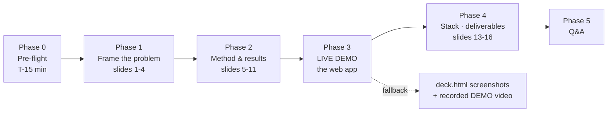

# Presentation Map - costsight (Phase 1 demo)

The end-to-end plan for presentation day: how the **slides**
([`slides/deck.md`](slides/deck.md)) and the **live demo**
([`DEMO.md`](DEMO.md)) interleave, who presents what, timing, the Q&A bank,
and the fallback plan. Target: a tight **~12-minute** talk + demo, then Q&A.

## The map at a glance



## Timeline & ownership

Work split mirrors the deck's *Work Division* slide: **Halil** owns the
research/architecture narrative, **Furkan** drives the live web app he built.

| # | Phase | Slides / screen | Owner | Time |
|---|---|---|---|---:|
| 0 | **Pre-flight** (off-stage) | servers up, browser ready, tour reset | both | - |
| 1 | Title + **Problem** | 1-2 | Halil | 1:00 |
| 2 | **Solution** pipeline + what sets it apart | 3-4 | Halil | 1:30 |
| 3 | Synthetic data + **4 detectors** (contract) | 5-6 | Furkan | 1:30 |
| 4 | **Empirical results** (F1, matrix, overlay, 25-seed) | 7-10 | Halil | 2:30 |
| 5 | **Alert quality** by severity | 11 | Halil | 0:45 |
| 6 | **▶ LIVE DEMO** - the web app | *app* | Furkan | 3:00 |
| 7 | Tech stack + **achieved deliverables** | 13-14 | Furkan | 1:00 |
| 8 | Limitations + work division | 15-16 | Halil | 0:45 |
| 9 | **Q&A** | - | both | open |

> Running long? Compress Phase 4 to the 25-seed table only, and trim the demo
> to Summary → 3D explorer → detector comparison → CUR upload.

## Phase 3 - live demo flow (the centrepiece)

Follow the script in [`DEMO.md`](DEMO.md). On stage, hit these beats:

1. **Open the app** → the **guided tour** auto-plays ("the app introduces
   itself"). If it doesn't, click **Tour** (top-right).
2. **Summary** - KPIs count up; orbit the **3D spend skyline**; point out
   distinct anomalies, carbon, top savings.
3. **3D explorer** - rotate the cost **surface** (spikes = peaks) and the
   **anomaly cloud**. This is the 3D "wow".
4. **Detector comparison** - the thesis: *no single detector wins*. Flip the
   **3D｜2D toggle** once to show clarity is one click away.
5. **Alert log → Root-cause** - severity bands + the plain-English driver.
6. **Upload AWS CUR** - drag [`examples/cur_spike_storm_60d.csv`](examples/);
   every view recomputes on real data. **If the reviewer brings a CSV, use theirs.**

## Phase 0 - pre-flight checklist (do this T-15 min)

**Launch in presentation mode - one command (recommended):**

```powershell
powershell -ExecutionPolicy Bypass -File scripts/serve_demo.ps1
```

This is the bulletproof path: it builds the **production** frontend and serves
it with `vite preview` (no dev-server HMR / recompiles to glitch mid-demo),
runs uvicorn **without `--reload`**, sets `COSTSIGHT_OFFLINE=1` so **AI Explain
never makes a network call**, **pre-warms the cache** for the demo scenarios
(so switching scenarios live is instant), and opens the browser when ready.
Two PowerShell windows stay open - close them to stop. The whole app is
**fully offline** (no CDN/font fetches), so venue wifi is irrelevant.

- [ ] Ran `scripts/serve_demo.ps1`; saw **READY → http://localhost:5173**.
      (Manual fallback: `uvicorn cloud_anomaly.api:app --port 8000` +
      `npm --prefix frontend run preview`.)
- [ ] Load the app once; then `localStorage.clear()` + refresh so the
      **tour auto-plays** live.
- [ ] Browser zoom ~110%, window maximised, dark-mode off (the app is light).
- [ ] Have [`examples/`](examples/) open in a file explorer for the upload demo.
- [ ] Slides ready: open **`slides/deck.html`** (or a freshly rendered
      `deck.pdf` - `npx @marp-team/marp-cli slides/deck.md --pdf -o slides/deck.pdf`).
- [ ] Backup: the recorded demo video + screenshots, in case live fails.

## Phase 5 - Q&A bank (anticipating a tough reviewer)

| Likely question | Crisp answer |
|---|---|
| **Why synthetic data?** | Injected anomalies give *ground truth* → real Precision/Recall/F1. And it isn't only synthetic: the app ingests real AWS CUR via upload. |
| **Is STL's win significant?** | 25-seed mean ± std; std is tight (≈0.06). Bootstrap CI + Wilcoxon in [REPORT.md § 3.5](REPORT.md). |
| **Isn't 3D just a gimmick?** | It's informative here - surfaces show drift, clouds show outliers - and every 3D view has a **2D toggle**; motion honors `prefers-reduced-motion`. |
| **Why React, not Streamlit?** | Performance (no full-script rerun), real 3D/animation, clean API/UI split. Streamlit is archived under `legacy/` (tag `streamlit-v1`). |
| **Severity formula justification?** | deviation × duration × $impact → LOW/MED/HIGH. MEDIUM+ alerts are ~100% precision, so triage sees ~no false alarms. |
| **Why is Isolation Forest weak?** | Persistent shifts look "in-distribution" once stabilised - a known univariate limitation; it still has recall = 1.0 on point spikes. |
| **Does the ensemble help?** | ≥2-of-3 consensus cuts false positives; severity uses the max normalised score so alerting still works. |
| **Production path?** | S3 → Lambda → ECS → DynamoDB → SNS ([REPORT.md § 4.1](REPORT.md)); shipped as a Terraform module, ~$5-20/mo/tenant. |
| **Multi-cloud?** | Internal long-format + a documented GCP/Azure schema mapping ([REPORT.md § 4.2](REPORT.md)); AWS is wired end-to-end. |
| **How do we trust it on real bills?** | The CUR upload runs the full pipeline on real data live - happy to run your file. |

## Risk & fallback

- **Live demo fails / network flaky** → switch to the recorded video and the
  screenshots in the deck; narrate the same beats.
- **3D stutters on the projector** → hit the **2D toggle** (every chart has one);
  the story doesn't depend on 3D rendering smoothly.
- **API not reachable** → the app shows a clear error with the start command;
  restart `uvicorn` and refresh.
- **Uploaded CSV rejected** → fall back to the bundled `examples/cur_*.csv`
  (known-good); note the parser auto-detects standard CUR columns.

## One-line pitch (for the opener / closer)

> *costsight catches cloud-cost anomalies in hours, not weeks - four detectors
> compared head-to-head with open metrics, severity-scored alerts with
> plain-English root cause, and a 3D React web app you can point at your own
> AWS bill.*
