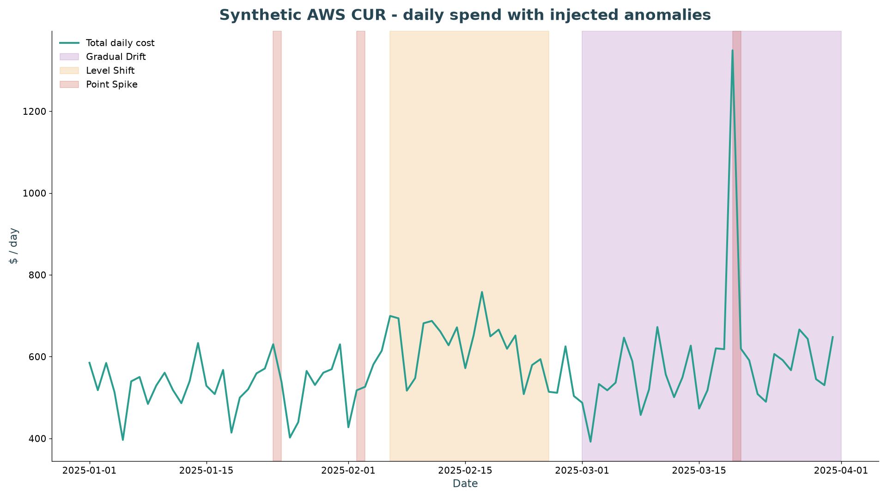
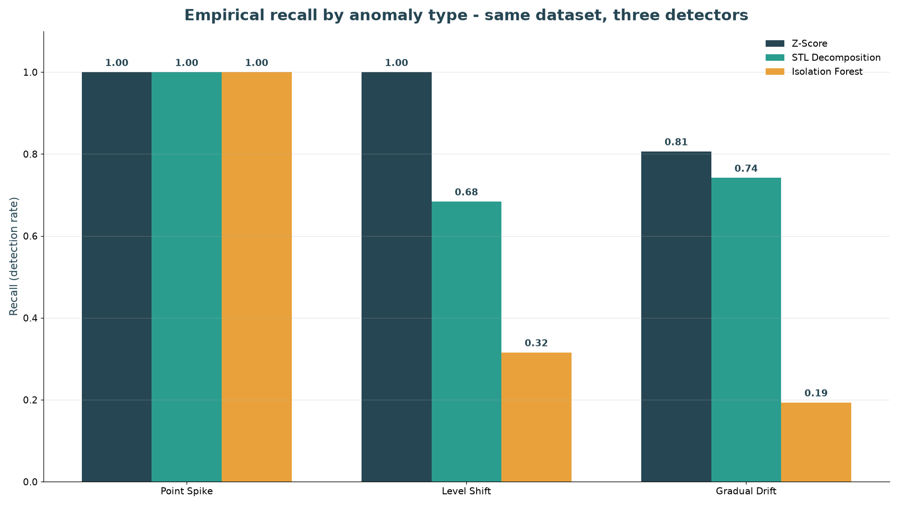
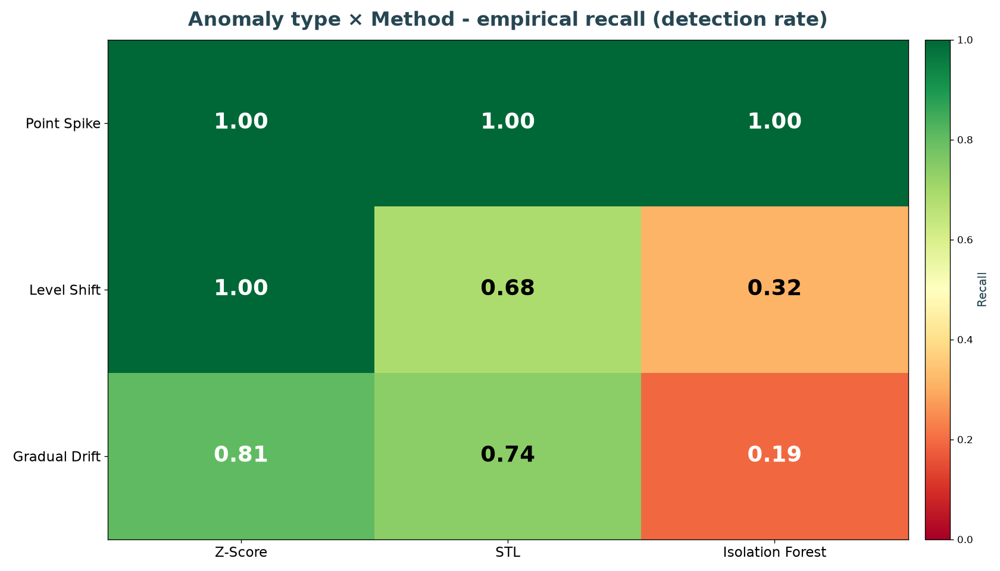
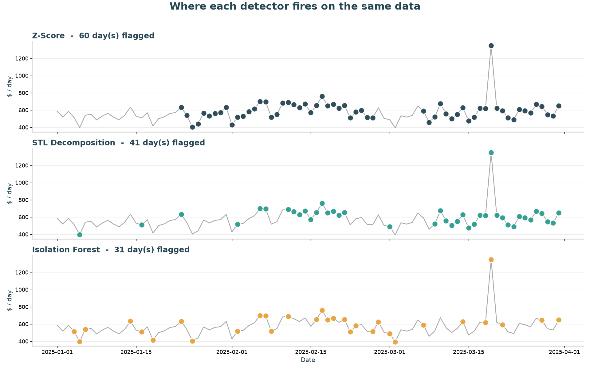

<!-- _class: title -->

# costsight

## Automated Cloud Cost Anomaly Detection
### Project 13 · Cloud Computing · Spring 2025-2026

**Furkan Can Karafil · Halil Utku Demirtaş**

<https://github.com/Urthella/costsight>

---

## The Problem

> 30%+ of cloud spend is wasted - *Flexera State of the Cloud, 2024*

The damage is already done by the time it shows up on the bill:

- **Runaway autoscaling** - misconfigured rules trigger resource explosions
- **Software bugs & leaks** - infinite loops can inflate the bill within hours
- **Invisible resources** - forgotten test environments, untagged resources

Cost anomalies need to be detected in **hours**, not weeks.

---

## Our Solution - End-to-End Pipeline

```
AWS CUR (synthetic ─►  Preprocessing ─► Detectors ─► Alerts ─► FastAPI ─► React app
 or your upload)                       • Z-Score
                                       • STL Decomposition       severity =
                                       • Isolation Forest        deviation
                                       • Ensemble (≥2 vote)      × duration × $impact
```

**Outcome:** a practical FinOps tool that catches anomalies in hours, with
full transparency about *which* algorithm caught *which* anomaly.

---

## What Sets This Apart

| | costsight | AWS Cost Explorer | Commercial tools |
|---|---|---|---|
| Detection algorithms     | **3 compared**    | 1 closed       | 1 black box  |
| Per-anomaly-type metrics | **Yes**           | No             | No           |
| Severity scoring         | **Open formula**  | Limited        | Proprietary  |
| Reproducibility          | **MIT, GitHub**   | Closed-source  | Closed       |

> **Gap we address:** cloud-cost-specific comparison across anomaly types
> remains limited in open literature.

---

## Synthetic Data - A Sneak Peek



Three anomaly types are injected with **ground-truth labels** so we can
compute Precision/Recall:

- **Point spike** - single-day cost explosion
- **Level shift** - persistent step up
- **Gradual drift** - slow upward creep

90 days × 7 AWS services × 2 regions = **1260 CUR rows**

---

## Three Detection Methods

| Method | Type | Strengths |
|---|---|---|
| **Z-Score** | Statistical baseline | Fast, interpretable, perfect on point spikes |
| **STL** | Time-series decomposition | Handles seasonality, drift, level shift |
| **Isolation Forest** | ML / ensemble | Multi-feature anomalies, no labels needed |

A fourth **Ensemble** detector takes a ≥2-of-3 consensus vote. Each detector
exposes the same `detect(df)` interface - alerts and evaluation are
**detector-agnostic**.

---

## Empirical F1 by Anomaly Type



**Three observations:**

- Z-Score is **perfect** on point spikes
- Z-Score is **blind** to drift / level shift
- STL is **strongest overall**
- Isolation Forest is **mid-pack** but consistent across types

> Same data, three lenses - measured, not estimated.

---

## Anomaly Type × Method Performance



Empirical F1 across **25 random seeds**, mean values:

- Z-Score → 0.96 / 0.01 / 0.00
- STL     → 0.52 / 0.62 / **0.73**
- iForest → 0.25 / 0.22 / 0.22

**Takeaway:** no single method wins all types - that's why we run all three.

---

## Where Each Detector Fires



- Z-Score lights up only the obvious spikes (3 days)
- STL captures spikes + drift + level shifts (~41 days)
- Isolation Forest adds a few mid-window flags (~31 days)

---

## Multi-Seed Robustness

25 independent random seeds, mean ± std F1:

| Detector | Point Spike | Level Shift | Gradual Drift | **Overall** |
|---|---:|---:|---:|---:|
| Z-Score          | 0.962 ± 0.078 | 0.012 ± 0.033 | 0.000 ± 0.000 | **0.105 ± 0.018** |
| **STL**          | 0.522 ± 0.082 | 0.616 ± 0.204 | 0.734 ± 0.052 | **0.757 ± 0.064** |
| Isolation Forest | 0.247 ± 0.035 | 0.216 ± 0.060 | 0.217 ± 0.034 | **0.319 ± 0.036** |

> Std is tight: STL's lead is **statistically robust**, not a single-seed fluke.

---

## Alert Quality by Severity

The severity formula `deviation × duration × $impact` is a triage filter.

| Severity | STL precision | iForest precision | Z-Score precision |
|---|---:|---:|---:|
| MEDIUM | **1.000** | **1.000** | **1.000** |
| LOW    |   0.860   |   0.406   |   1.000   |

**MEDIUM and HIGH alerts are ~100% true positives** across detectors - a
FinOps engineer who only triages MEDIUM+ sees almost no false alarms.

---

## The Web App - 3D-forward, run on *your* data

A **React** single-page app over a **FastAPI** backend: one cached
`/api/snapshot` fans out across **19 views** in five groups.

- **3D by default** - detector comparison, cost surface, forecast ribbons,
  carbon, drift and a WebGL **3D explorer** (drag to orbit); every chart has a
  **3D｜2D toggle** for precise reading
- **Run on your bill** - drag-and-drop an **AWS CUR `.csv`** and every view
  recomputes on real data
- **Guided tour** introduces the layout on first open; motion everywhere,
  with `prefers-reduced-motion` honored
- **Fast** - server-side snapshot caching + warm-up (~0.2 s loads), code-split
  bundles (WebGL loads only where needed)

> Clean API/UI split: the same backend serves the app, the REST API, and a
> Terraform-deployable production path.

---

## Tech Stack

**Backend** - Python 3.11+

- **pandas / NumPy / PyArrow** - data processing
- **statsmodels** (STL) · **scikit-learn** (Isolation Forest) · **SciPy** (stats)
- **FastAPI / uvicorn** - REST API (`/api/snapshot`)

**Frontend** - React 19 + Vite + TypeScript

- **Plotly.js** (2D + 3D charts) · **React Three Fiber / three.js** (WebGL)
- **Tailwind v4** · **Framer Motion** (animation) · **TanStack Query**

**Ops** - GitHub Actions CI (Python 3.11/3.12 + frontend build) · Docker · Terraform

> Backend: `uvicorn cloud_anomaly.api:app`. Frontend: `npm run dev`.
> Or the whole stack: `docker compose up`.

---

## Achieved Deliverables

- **Working Python pipeline** - 4 detectors, 21 tests green on CI
- **Automated alert system** - JSON + CSV, severity-banded
- **Root-cause hints** - *"us-east-1 region drove 100% of the increase"*
- **React web app over FastAPI** - 19 views, 3D charts, guided tour, live AWS CUR upload
- **Documented GitHub repo** - README, REPORT, DEMO, examples, MIT license
- **Multi-seed benchmark** - 25 seeds, mean ± std reported
- **Demo video** - 2.5-minute walkthrough of the web app

---

## Limitations & Future Work

| Limitation | Future direction |
|---|---|
| Manual CUR upload (batch) | Automated continuous ingestion (S3 → Lambda) |
| Univariate per service | Multi-feature & multi-granularity (account/region/tag) |
| Batch-only execution | Streaming via Kafka / Kinesis |
| Heuristic severity formula | Learn band thresholds from FinOps feedback |
| Single cloud (AWS) | Multi-cloud schema (GCP, Azure) |

> Phase 1 scope is intentionally bounded - these are Phase 2 / Level 2 work.

---

## Work Division

| Phase 1 / Phase 2 - Joint Contributions |
|---|

- **Halil Utku Demirtaş** - CUR generator, preprocessing, alert module,
  Precision / Recall framework, system architecture
- **Furkan Can Karafil** - STL implementation, Isolation Forest model,
  Z-Score baseline, React web app + FastAPI, comparative analysis
- **Joint** - GitHub repo, CI, multi-seed benchmark, technical report,
  slide deck, demo video

---

<!-- _class: title -->

# Thank you

## We welcome your questions

**Repository:** <https://github.com/Urthella/costsight>
**Demo video:** see `DEMO.md` for the recorded walkthrough
**Report:** `REPORT.md` for the full technical write-up

Furkan Can Karafil · Halil Utku Demirtaş
